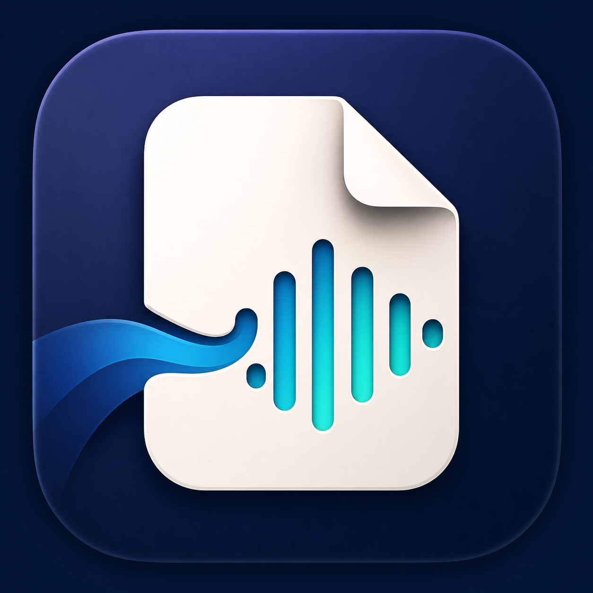

# Audibit

<p align="center">
  
</p>

<p align="center">
  A private, native macOS document reader that turns PDFs, presentations,
  text files, and images into clear spoken audio.
</p>

Audibit combines native document rendering, layout-aware text extraction,
offline OCR, system speech, and optional on-device neural voices in a focused
Mac interface. Documents remain on the computer, speech is generated locally,
and complete readings can be exported as MP3 files.

**[Download the latest Audibit for macOS](https://github.com/Enoch-015/Audiobit/releases/download/latest-main/Audibit.dmg)**

Requires macOS 15 or newer on Apple Silicon.

## Highlights

- Native SwiftUI interface designed for macOS, with a restrained
  document-first layout rather than a card-based dashboard.
- PDF reading through PDFKit, including layout-aware paragraph reconstruction
  based on visible whitespace instead of unreliable raw PDF line breaks.
- PowerPoint (`.pptx`) extraction with slide text, paragraph boundaries, and
  embedded image display.
- Vision OCR for scanned PDFs and supported image formats.
- Built-in Mac voices through `AVSpeechSynthesizer`, available immediately and
  fully offline.
- Optional Kokoro Enhanced Voice powered locally by MLX on Apple Silicon.
- Rolling speech buffers that prepare upcoming chunks while the current chunk
  plays.
- Synchronized section navigation, reading progress, and paragraph
  highlighting.
- Background MP3 export using the selected speech engine, voice, and speed.
- Local session restoration, extraction caching, recent documents, search,
  drag and drop, and **Open With** support.
- Persistent named playlists with drag reordering, automatic document
  transitions, an Up Next menu, and document or playlist repeat modes.
- Light mode, dark mode, keyboard navigation, VoiceOver labels, and native
  accessibility behavior.

## Privacy

Audibit is local-first:

- Document contents are not uploaded.
- OCR runs with Apple Vision on the Mac.
- Mac Voices and Kokoro speech generation run on-device.
- Generated audio remains local.
- The only optional network operation is downloading the Kokoro model and
  voice assets after explicit user confirmation.

Exported MP3 files are stored in:

```text
~/Documents/Audiobit
```

The directory is created automatically on the first export. Existing exports
are never overwritten; Audibit adds a numeric suffix when necessary.

## Requirements

| Requirement | Value |
| --- | --- |
| Operating system | macOS 15 or newer |
| Processor | Apple Silicon |
| Default speech | Installed macOS system voices |
| Enhanced speech | Optional Kokoro model download, approximately 600 MB |
| Internet connection | Not required after optional model installation |

Kokoro currently targets tested English voices. Mac Voices expose the
languages and voices installed in macOS.

## Supported documents

| Format | Handling |
| --- | --- |
| PDF | Embedded-text extraction, visual paragraph reconstruction, and OCR fallback |
| Scanned PDF | Per-page Vision OCR |
| PowerPoint (`.pptx`) | Slide text, explicit paragraph breaks, and embedded images |
| TXT and Markdown | Ordered paragraph extraction |
| RTF | Native attributed-text decoding |
| PNG, JPEG, TIFF, HEIC | Vision OCR |

Encrypted, corrupt, empty, and unsupported files produce a clear error instead
of terminating the application.

## Install from the DMG

1. Download `Audibit.dmg`.
2. Open the disk image.
3. Drag **Audibit** into the **Applications** folder.
4. Launch Audibit from Applications.

Development builds are ad-hoc signed and are not Apple-notarized. If macOS
blocks the first launch, Control-click Audibit, choose **Open**, then confirm
**Open**. A public notarized release requires a Developer ID Application
certificate and Apple notarization credentials.

## Automatic updates

Audibit 1.1 and later include Sparkle for secure in-app updates. The app checks
after launch when a check is due, then no more than once every 24 hours. There
is no custom polling loop. Use **Audibit → Check for Updates…** at any time, or
change automatic checking and downloading in **Settings → Updates**.

Updates are published only after a `main` branch build passes the full test,
bundle, signature, and DMG verification pipeline. Sparkle verifies every update
with Audibit’s embedded EdDSA public key before replacing the installed app.
Document caches, playlists, reading sessions, exported audio, settings, and
downloaded Kokoro assets remain outside the app bundle and survive updates.

Versions older than 1.1 do not contain Sparkle and require one final manual DMG
installation. After installing 1.1 or newer in Applications, subsequent
updates can install and relaunch automatically.

## Use Audibit

1. Open a supported document with the toolbar, drag it into the window, or use
   Finder’s **Open With** menu.
2. Select a page, slide, or section from the sidebar.
3. Choose a speech engine, voice, and speed from the playback controls.
4. Press Play. Audibit highlights and reveals the current reading section.
5. Choose **Export Audio** in the toolbar to create an MP3 in the background.

Create playlists with the **+** button beside Playlists in the sidebar. Add
multiple documents, add the currently open document, or drop files into the
playlist editor. Double-click an item to start there. During playback, the
bottom bar provides previous/next-document controls, an Up Next menu, and
repeat modes for the current document or complete playlist. Unavailable files
are skipped and reported without interrupting the remaining queue.

Kokoro can be installed or removed from **Settings → Speech**. If its assets
are unavailable or synthesis fails, Audibit safely falls back to Mac Voices.

## Build from source

### Prerequisites

- Xcode with the macOS 15 SDK or newer
- Swift 6
- Apple Silicon Mac
- Xcode Metal Toolchain for MLX

Install the Metal Toolchain if necessary:

```sh
xcodebuild -downloadComponent MetalToolchain
```

Resolve dependencies and run the application:

```sh
swift package resolve
swift run DocumentReader
```

Alternatively, open `Package.swift` in Xcode and run the `DocumentReader`
scheme.

### Build the app bundle

```sh
./Scripts/build-app.sh
open .build/app/Audibit.app
```

The script creates an arm64 release build, embeds the MLX Metal library and
LAME framework, applies the Audibit icon, and ad-hoc signs the complete bundle.

### Build the installer

```sh
./Scripts/build-dmg.sh
```

The finished installer is written to:

```text
dist/Audibit.dmg
```

The release script verifies both the app signature and the completed disk
image, then prints the SHA-256 checksum.

### Configure update publishing

The repository publishes a rolling `latest-main` GitHub Release from
`.github/workflows/publish-main-update.yml`. Before enabling it:

1. Keep the Sparkle private key backed up outside the repository. The local
   bootstrap key is stored in the login Keychain under the `Audibit` account,
   with a permission-restricted export at
   `~/Documents/Audibit-Release-Keys/Audibit-Sparkle-private-key`.
2. In the GitHub repository, open **Settings → Secrets and variables →
   Actions**.
3. Create a repository secret named `SPARKLE_ED_PRIVATE_KEY`.
4. Paste the complete contents of the exported private-key file as the secret
   value.
5. Run the **Publish Main Update** workflow once from GitHub Actions (or push
   the next change to `main`) to create the initial `latest-main` release and
   appcast.

The workflow fails before building or publishing if that secret is absent. It
never prints the secret, writes it only to the runner’s temporary directory,
and removes the temporary file after generating the signed appcast. Do not
generate a replacement key after users have installed an updater-enabled
build; preserve and restore the existing key instead.

Each successful `main` workflow uses an increasing numeric bundle build,
creates a signed DMG and appcast, and replaces the stable release assets only
after validation succeeds. Failed or cancelled builds are never advertised.

## Tests

Run the full suite with:

```sh
swift test
```

The tests cover supported-type detection, PDF visual spacing, PowerPoint
extraction, text chunking, session compatibility, Kokoro asset verification,
playlist persistence and repeat navigation, unique export naming, and real MP3
encoding.

## Architecture

Audibit uses small, explicit layers:

- `DocumentExtractor` normalizes supported files into `DocumentContent` and
  ordered `ReadingSection` values.
- `PDFDocumentExtractor` combines PDFKit geometry with Vision OCR fallback.
- `PresentationDocumentExtractor` reads PowerPoint XML and media assets.
- `SpeechController` owns shared chunk navigation, highlighting, engine
  switching, saved position, and fallback behavior.
- `AppleSpeechEngine` provides native system speech.
- `KokoroSpeechEngine` performs local MLX synthesis with bounded rolling audio
  buffers.
- `KokoroModelManager` downloads, verifies, installs, migrates, and removes
  model assets.
- `AudioExportController` renders chunked speech in the background and encodes
  a bounded-memory MP3 through the bundled LAME framework.
- `PlaylistController` persists named document queues and coordinates
  extraction, document transitions, skipped items, and repeat behavior above
  the speech engines.

## Local data

Audibit stores extraction caches, reading sessions, recent documents, and
optional Kokoro assets in the user’s Library and Application Support
directories. MP3 exports are kept separately under `~/Documents/Audiobit`.
Removing the enhanced voice from Settings deletes its downloaded model assets.

## Known limitations

- macOS 15+ and Apple Silicon are required.
- EPUB, DOCX, spreadsheets, and additional presentation formats are not yet
  supported.
- Complex multi-column PDFs depend on the reading order exposed by PDFKit.
- OCR quality depends on source resolution and scan clarity.
- Development DMGs are not notarized without external Apple Developer
  credentials.

## Licensing

Kokoro model weights are Apache-2.0 licensed. KokoroSwift, MLX Swift,
MisakiSwift, MLXUtilsLibrary, LAME, and other dependencies retain their
respective upstream licenses. See
[THIRD_PARTY_NOTICES.md](THIRD_PARTY_NOTICES.md) for details.
